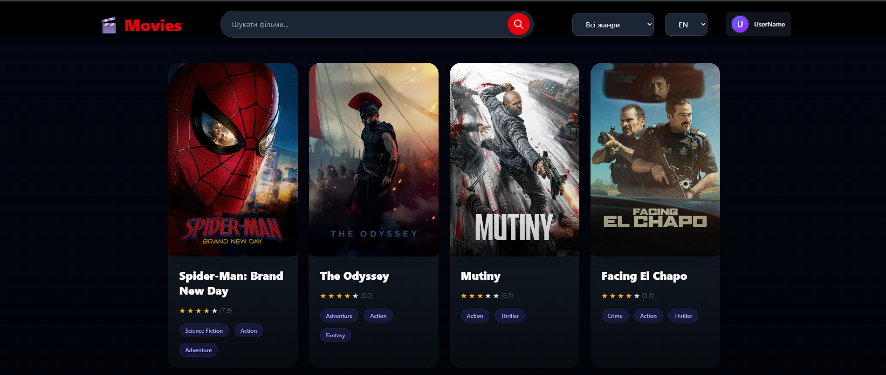

# 🎬 Movies — Movie Catalog App

A responsive movie catalog web app built with **React + TypeScript + Vite**, powered by the [TMDB API](https://www.themoviedb.org/documentation/api).

## 🚀 Live Demo
Check out the deployed app: **[test-react-w5t9.vercel.app](https://test-react-w5t9.vercel.app)**

## Features

- 🔍 Search movies by title
- 🎭 Filter by genre
- ⭐ Star ratings for each movie
- 🌐 Language switcher (EN / UA)
- 🌙 Dark theme UI
- 📱 Responsive layout

## Tech Stack

- **React** — UI library
- **TypeScript** — static typing
- **Vite** — build tool & dev server
- **TMDB API** — movie data source

## Getting Started

### Prerequisites

- Node.js (v18+ recommended)
- A free [TMDB API key](https://www.themoviedb.org/settings/api)

### Installation

```bash
git clone https://github.com/VladTsiusmak/test_react.git
cd test_react
npm install
```

### Environment Variables

Create a `.env` file in the root directory:

```
VITE_TMDB_API_KEY=your_api_key_here
VITE_TMDB_READ_TOKEN=your_read_token_here
```

> ⚠️ Never commit your `.env` file — it's already included in `.gitignore`.

### Run locally

```bash
npm run dev
```

The app will be available at `http://localhost:5173`.

## Screenshots



## License

This project is for educational/portfolio purposes.
